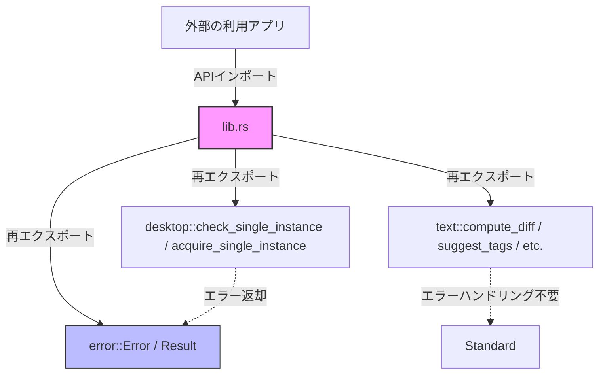
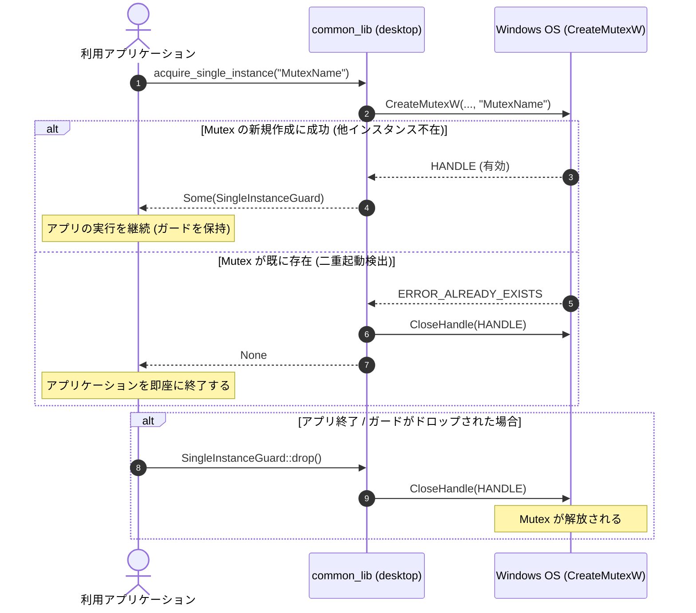
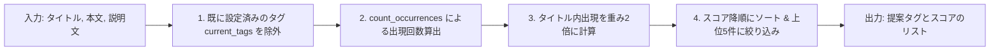

# Architecture Specification (ARCHITECTURE.md)

本ドキュメントは、`common_lib` プロジェクトの全体アーキテクチャ、ディレクトリ構成、採用技術スタック、および主要モジュール間のデータフローと設計意図について記述した設計書です。

---

## 1. システムの概要と目的

`common_lib` は、Rust言語で記述された、再利用性の高い汎用ユーティリティライブラリです。複数のアプリケーション間で共有して利用されることを前提に設計されています。

### 主な目的
- **デスクトップアプリの信頼性向上**: Windows環境における多重起動（二重起動）を防止する仕組みを安全かつ統一的に提供します。
- **テキスト処理・解析処理の集約**: LCS（最長共通部分列）による差分検出、大文字小文字を区別しない単語カウント、バイト数の可読化フォーマット、重要度ベースのタグ提案アルゴリズムなど、頻出するテキスト処理を高速かつ単一のライブラリに集約します。
- **堅牢性の確保**: Rustの強力な型システムとエラーハンドリング機構を活用し、安全で予測可能な動作を保証します。

---

## 2. 採用技術スタック

本プロジェクトは、最小限かつ安定した外部依存関係で構成されています。

- **コア言語**: Rust (Edition 2024)
  - 最新のエディション機能と標準ライブラリの安定性を最大限に活用しています。
- **主要ライブラリ (Dependencies)**:
  - `serde = { version = "1.0", features = ["derive"] }`
    - 差分計算結果のシリアライズおよびデシリアライズ処理に利用しています。
  - `windows = { version = "0.62.2", features = ["Win32_System_Threading", "Win32_Foundation", "Win32_Security"] }`
    - Windows環境用のターゲット依存関係です。Win32 APIを介して Named Mutex を制御し、二重起動防止機能を実装するために使用しています。

---

## 3. アーキテクチャとディレクトリ構造の意図

プロジェクトは Cargo 標準のライブラリレイアウトを採用しており、ドキュメントや開発者ルールが以下のように明確に整理されています。

```text
common_lib/
├── .agents/
│   └── AGENTS.md           # AIエージェント向け指示書
├── .github/
│   └── workflows/
│       └── ci.yml          # CI/CD自動化定義
├── docs/                   # 技術・設計・仕様関連のドキュメント (大文字スネークケース)
│   ├── ARCHITECTURE.md     # 本書：アーキテクチャ設計書
│   ├── DIAGRAM.md          # システム構成・データフロー図
│   ├── EXAMPLES.md         # クックブック・実装例
│   ├── FOOTPRINTS.md       # パフォーマンスおよびリソース使用量計測結果
│   ├── INSTRUCTIONS.md     # AIコーディング・開発指示書
│   ├── SPEC.md             # 機能・API仕様書
│   └── TODO.md             # 開発ロードマップ・Todo管理
├── src/                    # ソースコード
│   ├── desktop.rs          # プラットフォーム（Windows）依存機能
│   ├── error.rs            # 共通エラー・結果型定義
│   ├── lib.rs              # クレートの玄関口（APIの再エクスポート）
│   └── text.rs             # プラットフォーム非依存のテキスト処理
├── Cargo.toml              # パッケージ設定ファイル
└── CHANGELOG.md            # 変更履歴
```

### 設計意図
- **ドキュメントの独立**: コードの修正に伴うドキュメント保守を容易にし、AIエージェントによるドキュメント自動整合チェックの対象を `docs/` およびルートディレクトリに配置しています。
- **モジュールの粗結合化**: OS依存の強い `desktop` ドメインと、ピュアなRustで動作する `text` ドメインを分離し、両者が直接密結合しない設計としています。
- **クロスプラットフォーム対応の分離**: プラットフォーム固有の実装があるモジュール（`desktop`）は、非Windows環境用にダミー定義と関数スタブを提供することで、他OSのコンパイルおよびテストを阻害しない工夫を行っています。

---

## 4. データフローと主要モジュール間の連携

主要モジュールである `desktop`（二重起動防止）と `text`（テキスト処理）は、共通モジュールである `error` の定義するエラーハンドリング機構を媒介として連携します。

### 4.1 モジュール関係図



### 4.2 二重起動防止のデータフロー (Named Mutex)

Windows API の `CreateMutexW` を介した多重起動制御のプロセスライフサイクルは以下の通りです。



### 4.3 テキスト処理のデータフロー (例: タグ自動提案)

入力された文章データを評価し、重要度スコア（出現頻度 + 重み付け）に基づいてソートされた上位のタグ情報をクライアントに返却します。


