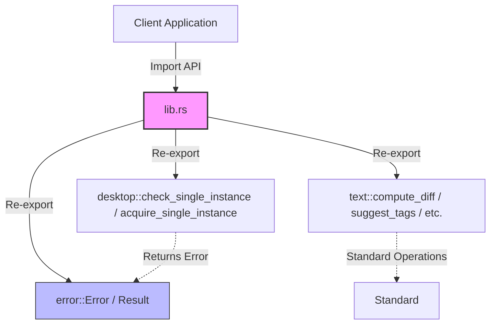
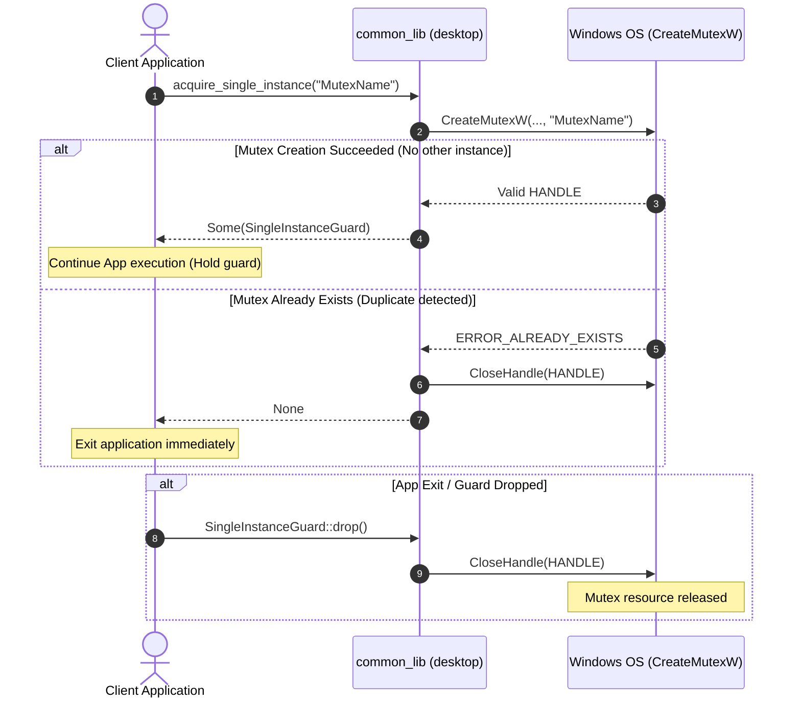
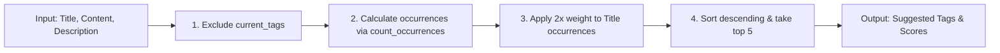

# Architecture Specification (ARCHITECTURE.md) - common_lib

**English** | [日本語版](../ja/ARCHITECTURE.md)

This document describes the overall system architecture, directory structure, tech stack, data flows, and design rationale of the `common_lib` project.

---

## 1. System Overview & Objectives

`common_lib` is a highly reusable utility library written in Rust, designed to be shared across multiple desktop and command-line applications.

### Primary Objectives
- **Desktop Application Reliability**: Provide a unified and safe mechanism for single-instance application control on Windows environments.
- **Consolidated Text Processing**: Consolidate common text operations (line-by-line diff using LCS, case-insensitive word counting, human-readable byte formatting, and tag suggestion scoring) into a fast, reliable library.
- **Robustness**: Utilize Rust's strong type system and strict error handling to guarantee safe and predictable behavior.

---

## 2. Technology Stack

This project is built with minimal and stable external dependencies.

- **Core Language**: Rust (Edition 2024)
- **Key Dependencies**:
  - `serde = { version = "1.0", features = ["derive"] }`
    - Used for serialization and deserialization of diff results.
  - `windows = { version = "0.62.2", features = ["Win32_System_Threading", "Win32_Foundation", "Win32_Security"] }`
    - Target-specific dependency for Windows, using Named Mutex via Win32 API for single-instance application guards.

---

## 3. Architecture & Directory Structure Rationale

The project adopts standard Cargo library conventions, with clear documentation and AI guidelines:

```text
common_lib/
├── .agents/
│   └── AGENTS.md           # Instructions for AI Agents
├── .github/
│   └── workflows/
│       └── ci.yml          # CI/CD Automation
├── docs/                   # Multilingual documentation
│   ├── en/                 # English documentation
│   └── ja/                 # Japanese documentation
│       ├── ARCHITECTURE.md # Architecture Specification (this document)
│       ├── CHANGELOG.md    # Changelog
│       ├── CONTRIBUTING.md # Contributing Guidelines
│       ├── DIAGRAM.md      # System Diagrams & Flowcharts
│       ├── EXAMPLES.md     # Advanced Examples & Cookbook
│       ├── FOOTPRINTS.md   # Performance & Resource Footprints
│       ├── INSTRUCTIONS.md # AI Coding Instructions
│       ├── RELEASE.md      # Release Manual
│       ├── SECURITY.md     # Security Policy
│       ├── SPEC.md         # Functional Specification
│       ├── TESTING.md      # Testing Guide
│       └── TODO.md         # Roadmap & Todo
├── src/                    # Source code
│   ├── desktop.rs          # Platform (Windows) specific features
│   ├── error.rs            # Common Error and Result types
│   ├── lib.rs              # Crate root (API re-exports)
│   └── text.rs             # Platform-agnostic text utilities
├── Cargo.toml              # Package manifest
├── README.md               # English project overview
├── README_JA.md            # Japanese project overview
└── CHANGELOG.md            # Redirect link
```

### Design Principles
- **Multilingual & Decoupled Documentation**: Facilitates maintenance alongside code changes by keeping synchronized documentation under `docs/en/` and `docs/ja/`.
- **Loose Coupling**: Keeps platform-dependent logic (`desktop`) separate from pure Rust text processing (`text`).
- **Platform Abstraction**: Modules with platform-specific code (`desktop`) provide fallback dummy implementations for non-Windows platforms so that cross-platform builds and testing never break.

---

## 4. Data Flow & Inter-module Communication

The core modules (`desktop` and `text`) interact through common error handling provided by `error`.

### 4.1 Module Relationship Diagram



### 4.2 Single Instance Execution Sequence (Named Mutex)

The process lifecycle for single instance execution control via `CreateMutexW` on Windows:



### 4.3 Text Processing Data Flow (e.g. Tag Suggestions)


