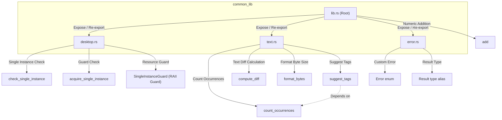
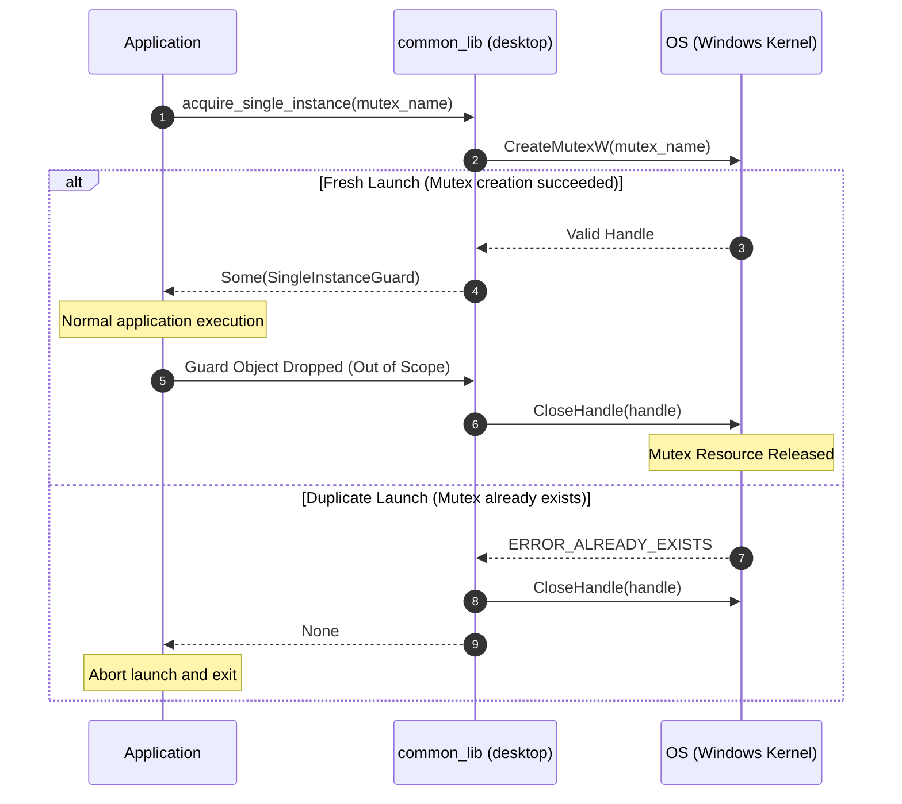
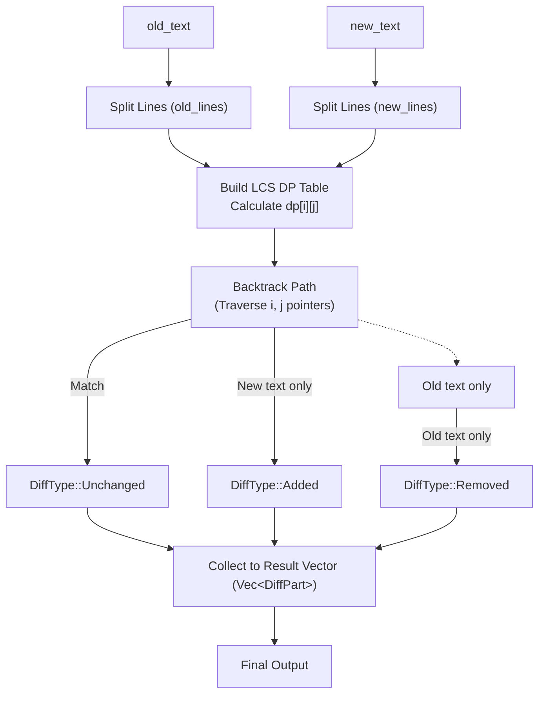

# System Diagrams (DIAGRAM.md) - common_lib

**English** | [日本語版](../ja/DIAGRAM.md)

Diagrams showing the module structure, single-instance execution sequence, and diff calculation data flow of `common_lib`.

---

## 1. Module and API Structure

---

## 2. Single Instance Execution Sequence (Desktop Guard Mode)

The lifecycle of single instance execution guard using `acquire_single_instance` on Windows:

---

## 3. Text Diff (LCS) Data Flow

The processing flow for `compute_diff` to extract line-by-line diffs:

