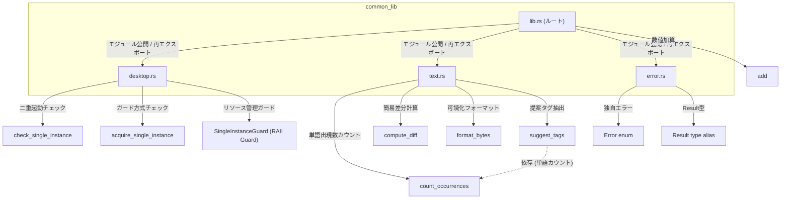
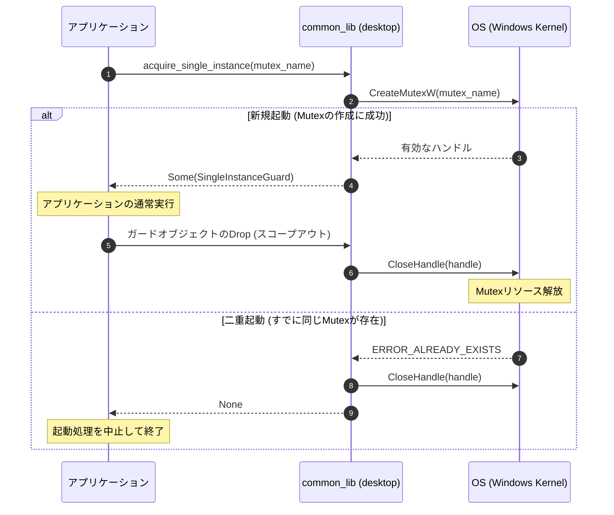
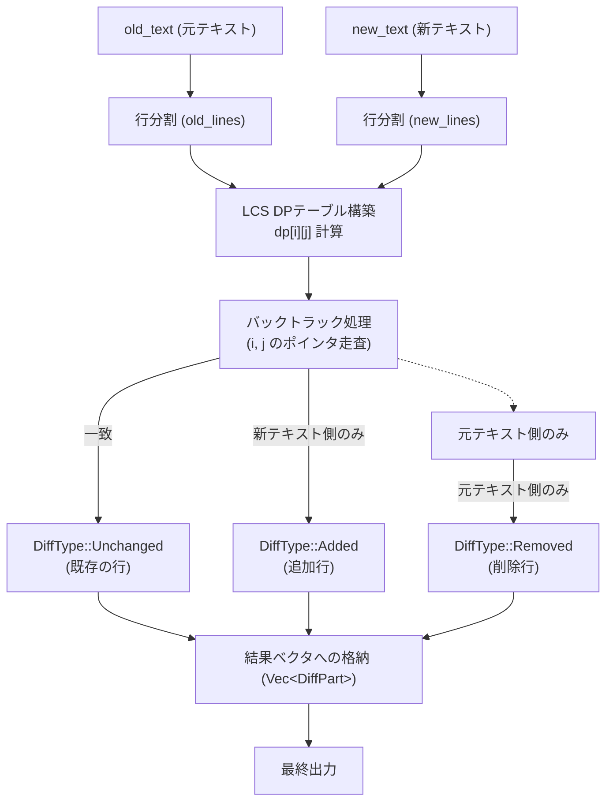

# システム構成図・データフロー (DIAGRAM.md) - common_lib

[English](../en/DIAGRAM.md) | **日本語版**

`common_lib` のモジュール構成、二重起動防止シーケンス、および差分計算のデータフローを示すダイアグラムです。

---

## 1. モジュールおよび API 構成

---

## 2. 二重起動防止シーケンス (デスクトップガード方式)

Windows環境下での `acquire_single_instance` を用いた二重起動防止のライフサイクルです。

---

## 3. 差分計算 (LCS) データフロー

`compute_diff` における、2つのテキスト（行単位）から差分結果を得るまでの処理フローです。

